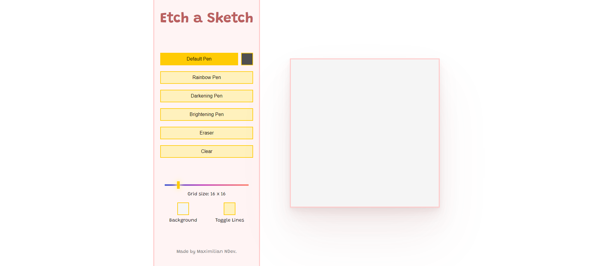

# Odin-Etch-a-Sketch

[Live link is here.](https://x6nenko.github.io/Odin-Etch-a-Sketch/)

## Project tasks.
- [x] Create a webpage with a 16x16 grid of square divs.
    - [x] Create the divs using JavaScript.
- [x] Set up a “hover” effect so that the grid divs change color when your mouse passes over them.
- [x] Add a button to set the number of squares per side for the new grid.

### Extra project tasks:
- [x] Rather than a simple color change from black to white, each interaction should randomize the square’s RGB value entirely.
- [x] Additionally, implement a progressive darkening effect where each interaction adds 10% more black or color to the square.

## Extra features. They are not required by a project. That's my list of optional ideas and tasks to make it better.

### Extra features that were implemented:
- [x] Better UI. Made it simple and clear.
- [x] Better hover effect. It works only when the mouse button is clicked.
- [x] Possibility to pick the color of the pen.
- [x] A better button to set grid size. Coded range input instead of showing prompt, as suggested by the project.
- [x] Brightening effect. It works the same as the darkening effect but in the opposite direction.
- [x] Eraser effect. Works as a pen, but instead of painting, it erases.
- [x] Clear option. It removes all previous paintings.
- [x] Possibility to pick the color of the grid background.
- [x] Checkbox to toggle displaying square lines (borders).

### Extra features and tasks to implement:
- [ ] Refactor the code. Make it more clean. DRY.
- [ ] Improve the accessibility of the custom checkbox. Currently, you can't tab it as a default input.

## Some of the struggles during coding the project.

### How I solved the task of adding darkening and brightening effects:
- I used a filter in CSS to change the brightness.
- I used getComputedStyle with getPropertyValue in JS to check the current values.

However, I wasn't sure how to apply changes based on the received value. I don't know if this approach is good, but there it is.
- getPropertyValue returns the string with the current value of filter.

Actually, this is all I needed. I had to check for the number inside of it and change it.
- So I simply removed all the returned text from the string and left only numbers with the help of parseFloat and replace.
- Later, I edited the number (increased or decreased brightness) and applied the new value.